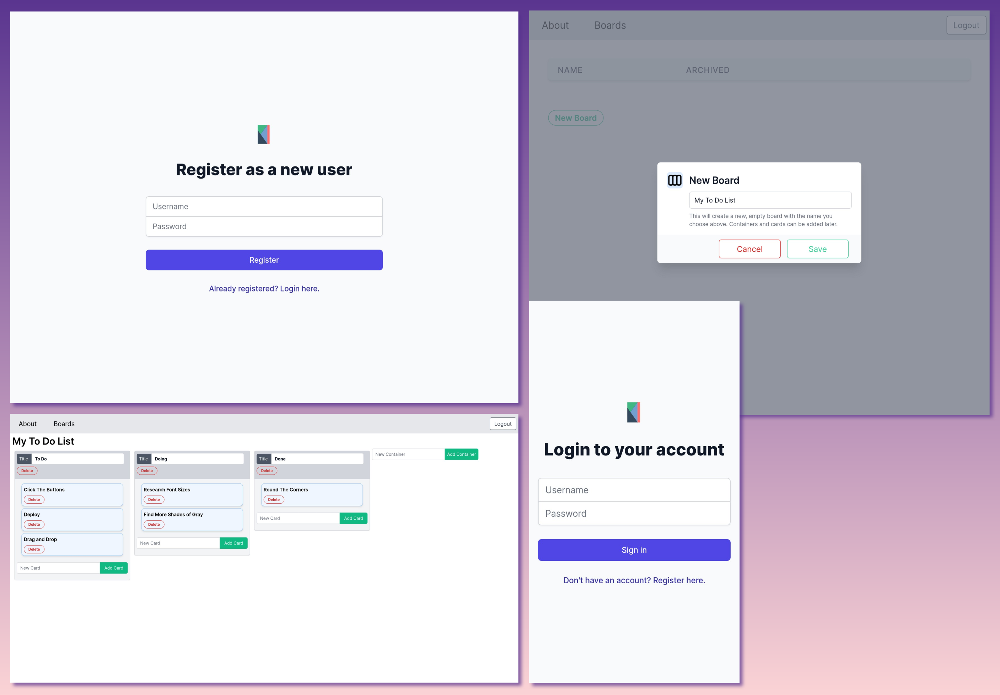

# Kanban frontend built with Vue

The backend, built with Django Rest Framework, is in [this repo](https://github.com/FirstPrinciplesDevelopment/kanban).



## Project setup

```
npm install
```

### Set API URL environment variable for development

Define `VUE_APP_API_BASE` in a file named `.env` under the project root like `VUE_APP_API_BASE=http://127.0.0.1:8000`

### Compiles and hot-reloads for development

```
npm run serve
```

> You may need to use an older version of nodejs or set the `NODE_OPTIONS=--openssl-legacy-provider` environment variable before running. See [this S.O.](https://stackoverflow.com/a/69699772/10307728) for context.

### Compiles and minifies for production

```
npm run build
```

### Lints and fixes files

```
npm run lint
```

### Customize configuration

See [Configuration Reference](https://cli.vuejs.org/config/).
